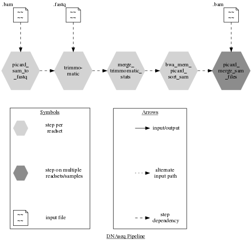

# Flowchart__2

Implemented a test flowchart in python for the 5 first steps of the [DNAseq pipeline](https://bitbucket.org/mugqic/genpipes/src/master/pipelines/dnaseq/dnaseq.py).

Library used = [graphviz](https://pypi.org/project/graphviz/).

## Flowchart : 

